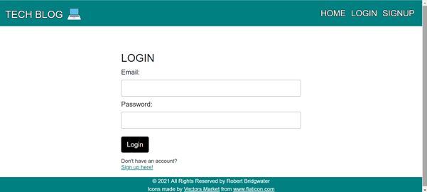
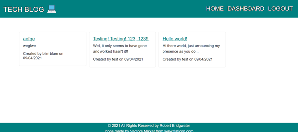

# Tech blog
-  This is a CMS-style "Tech blog" application, which has been deployed to Heroku. It is a simple design where developers can publish their blog posts and comment on one anothers posts.
I followed the MVC paradigm and used Handlebars.js as the templating language.

## Link To Deployed Heroku Application
Heroku App ---> [here](https://robbie-bridgwater-tech-blog.herokuapp.com/)

## Technologies Used

- XAMPP / MySQL
- MySQl workbench
- Javascript
- Handlebars
- Heroku

## Installation
- To run this application locally, do the following:
- (i) Enter `npm init -y` in the terminal to initialise the package.json
- (ii) Use this command `npm i <package name>` in the terminal to install the following node packages...
- (iii) `npm i mysql2`, `npm i express`, `npm i sequelize`, `npm i express-session`, `npm i connect-session-sequelize`, `npm i express-favicon`, `npm i masonry-layout`, `npm i dotenv`
- (iv) NB/ the `dotenv` package requires you to make a `.env` file in the root of your application. It is used to hide sensitive information such as your password and/or username.

## Usage
- You can either use the deployed Heroku version of the app (which you will find the link at the top of the ReadME) or run it locally.

- If you would prefer to run this application locally, you will need to clone this repository to your local device and follow the installation instructions above. You would then enter `npm start` in the terminal to run this app at your local host ---> http://localhost:`${PORTnumber}`/ eg. http://localhost:3001/

- If you wish to use an API testing tool like Insomnia or Postman you can. To use Insomnia you would need to run `node server.js` to start the server. You would then need to navigate to the insomnia app and type in the routes that would send or make the request you would like to test and of course select the correct method GET(READ), POST(CREATE), PUT(UPDATE), DELETE from the drop down list before clicking 'SEND'. In itallics below you can find some examples of the routes you will encounter within this app:

*GET all Blog Posts route - localhost:`${PORTnumber}`/eg. localhost:3001/*\
*GET  Blog Post by ID route - localhost:`${PORTnumber}`/post/`idNum`*\
*POST routes - localhost:`${PORTnumber}`/`route`/*\
*UPDATE/PUT Blog Posts by ID route - localhost:`${PORTnumber}`/dashboard/edit/`idNum`*\
*DELETE Blog Post by ID route- localhost:`${PORTnumber}`/post/`idNum`*\

If all requests are successfully made, you will see posts and comments added and a status '200 OK'. A '404' or '400' status will show up if there is an error or bad request made

## Screenshots
Application in action --->

- The Login Page.

- The Welcome Page.

- The Posts on the tech blog

## License

> This project was created under the standard MIT licence.

> [Learn more about this licence.](https://lbesson.mit-license.org/)

## Questions?

Please contact me through my GitHub provided below if you have any questions relating to how the application works or any of my other projects

My GitHub username is Robbie-Bridgwater

Link to my GitHub Profile ---> https://github.com/Robbie-Bridgwater
