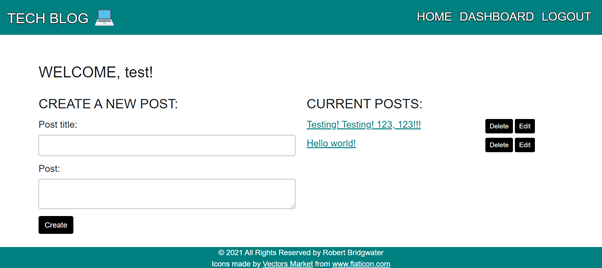

# Tech blog
-  This is a CMS-style "Tech blog" application, which has been deployed to Heroku. It is a simple design where developers can publish their blog posts and comment on one anothers posts.
I followed the MVC paradigm and used Handlebars.js as the templating language.

## Contents
Section | Description
------------ | -------------
[Deployment](#Deployment) | Link to the Deployed Heroku Application
[Technologies](#Technologies) | Technologies Used
[Installation](#Installation) | Installation Information
[Usage](#Usage) | How to use the application
[Screenshots](#Screenshots) | Screenshots of the deployed application
[Licence](#licence) | Licence for the source code
[Questions](#Questions?) | Where you can reach me

## Link To Deployed Heroku Application
Heroku App ---> [here](https://robbie-bridgwater-tech-blog.herokuapp.com/)

## Technologies Used

- XAMPP / MySQL
- MySQl workbench
- Javascript
- Handlebars
- Heroku

## Installation
 To run this application locally, do the following:
 - (i) Clone this repository from GitHub
- (ii) This app contains a package.json so you just need to run `npm i` from the root directory to install the relative node packages
- (iii) The `dotenv` package requires you to make a `.env` file in the root of your application. It is used to hide sensitive information such as your password and/or username.
- (iv) run `npm start` in the terminal from the root directory 

## Usage
You may do either of the following:
* Follow the installation instructions above to run the app on your local device.
* Use the deployed Heroku app, found at the top of this README

## Screenshots
Application in action --->

- The Login Page.

- The Welcome Page.

- The Posts on the tech blog

## License

> This project was created under the standard MIT licence.

> [Learn more about this licence.](https://lbesson.mit-license.org/)

## Questions?

Please contact me through my GitHub provided below if you have any questions relating to how the application works or any of my other projects

My GitHub username is Robbie-Bridgwater

Link to my GitHub Profile ---> https://github.com/Robbie-Bridgwater
